# Plug-in: @cap-js/attachment

In this blog series, I am going to write about my understanding on the CAP JS plugin, how it works and how we can implement them in the CAP service. 

The list of available CAP Plugin & Enhancements can be found in the below link. 

https://cap.cloud.sap/docs/plugins/

All the CAP plugins are named under the `scoped` module that has the namespace `@cap-js`. In this step, we are going 
to take a look at the `Attachment` plugin, that is available as a `Beta` version. The node package that provides the functionality for attachment is `@cap-js/attachment`. 

The source code of this plugin can be found in the repository. 
https://github.com/cap-js/attachments

The Attachments plugin provides out-of-the-box asset storage and handling. To use it, all we need to do is to extend the domain model by using the predefined aspect called Attachments, that is delivered as part of `@cap-js/attachment` plugin. 

**Preview:** 
The `attachment` plugin also add the facets requried to display the attachment section on the Object page. This attachment sections uses the control <a href="https://sapui5.hana.ondemand.com/#/api/sap.m.upload.UploadSetwithTable">sap.m.upload.UploadSetwithTable</a>.

> This is an Experimental API since version 1.120. In my example, i am using the UI5 version, 1.120.10. Using the later version i get an error from the macros Table API. 

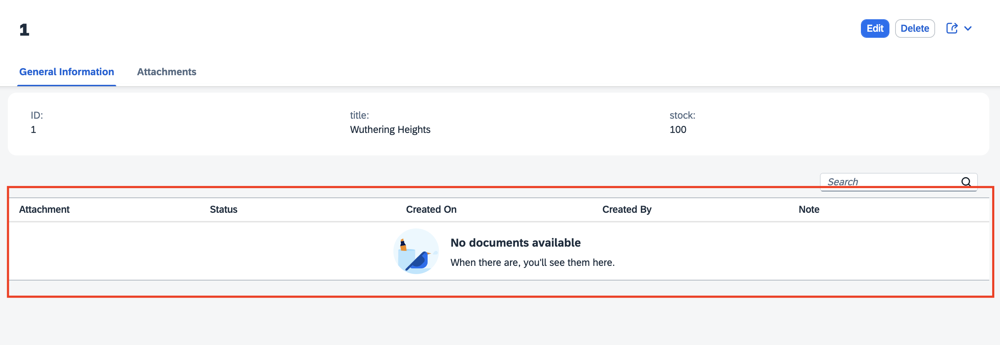

Clicking on the edit mode, will enable the Upload button. This button opens the file explorer to select the files. 

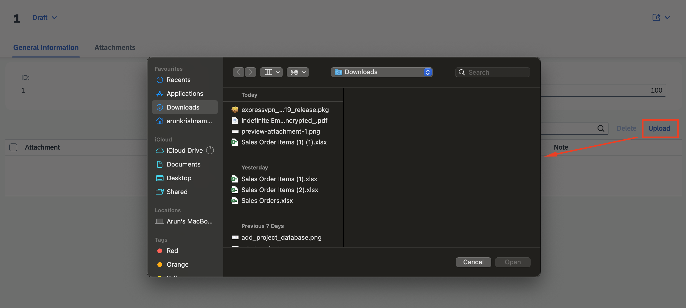

The selected files are added to the table and submitted to the backend upon save. 

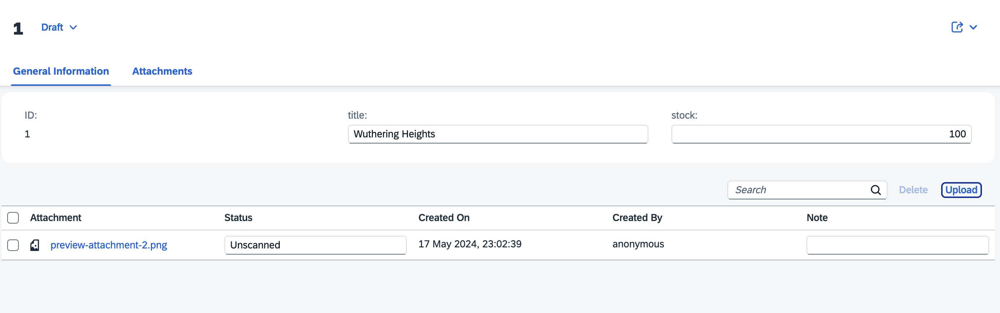


# Step 1: Initialize the CAP Project

Initalize the cap project using the command `cds init` in the root directory of the project folder. 

Execute the command `npm install` to install the dependencies. 

You can now start the cap server using the command `cds watch`. This will start the cap server on `http://localhost:4004`. 

The service would now be empty without any entities defined. 

# Step 2: Adding the sample CDS model.

To add the sample cds model, execute the command `cds add tiny-sample` in the terminal. 

This will add the entity definition in the `db` folder and add some sample data in the `data` folder. 

```
namespace my.bookshop;

entity Books {
  key ID : Integer;
  title  : String;
  stock  : Integer;
}
```

In the `srv` folder, the book entity is exposed. I have modified the generated code to remove the `@readonly` and add enabled draft handling. 

```
using my.bookshop as my from '../db/data-model';

service CatalogService {
    entity Books as projection on my.Books;
    annotate Books with @odata.draft.enabled;
}
```

Execute the command `cds watch` to run the service. 

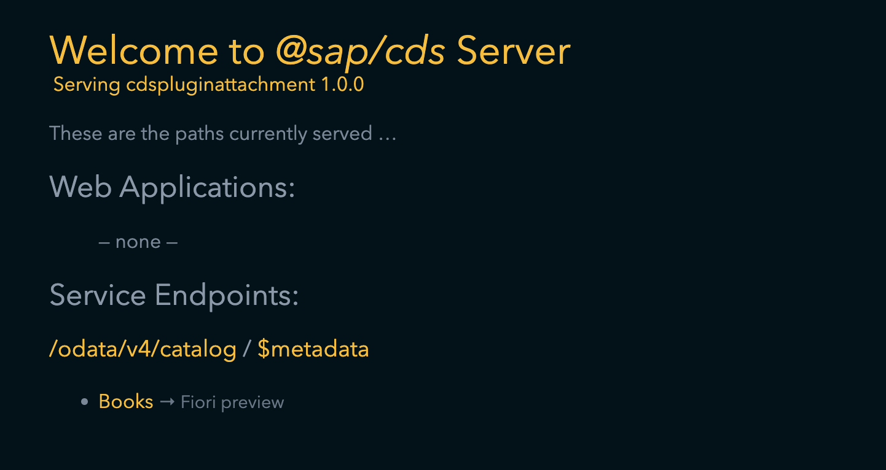

# Step 3: Add the UI5 Application 

Open the Fiori Application generator from the menu view -> command palette -> Fiori: Open Application Generator. 

In the wizard, select the list report template. 

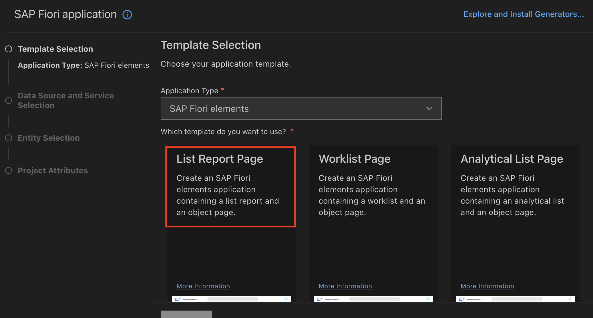

Map the data source to the local cap project and select the catalog service. 

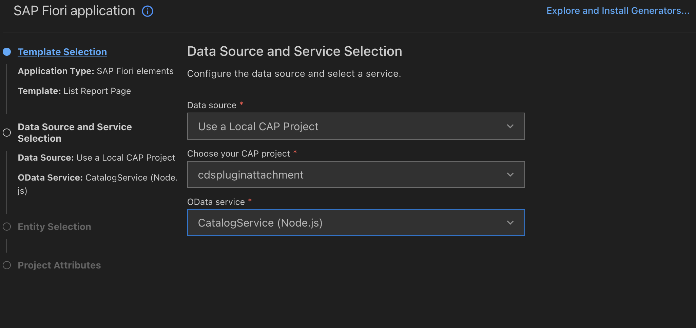

Select the books entity. 

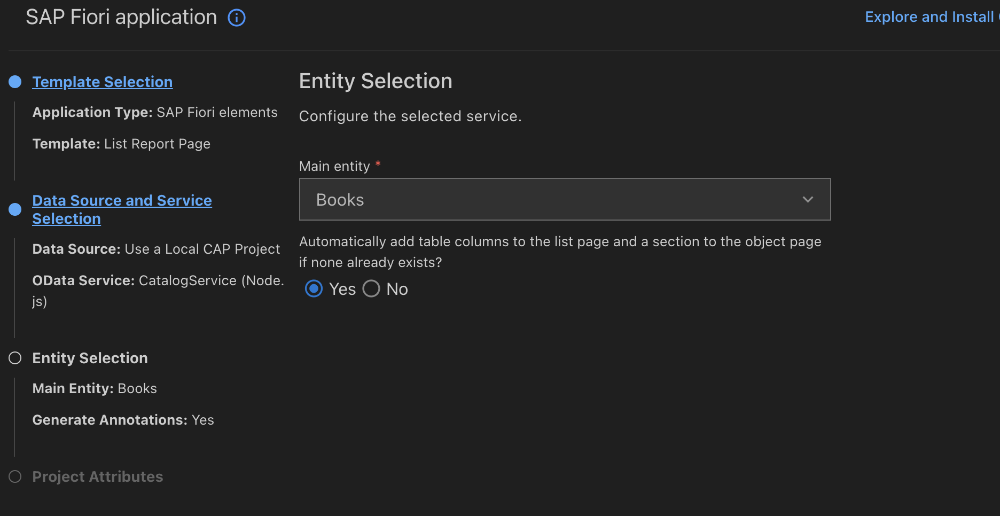

Enter the project details and click on finish. This will add the ui5 application in the app folder. 

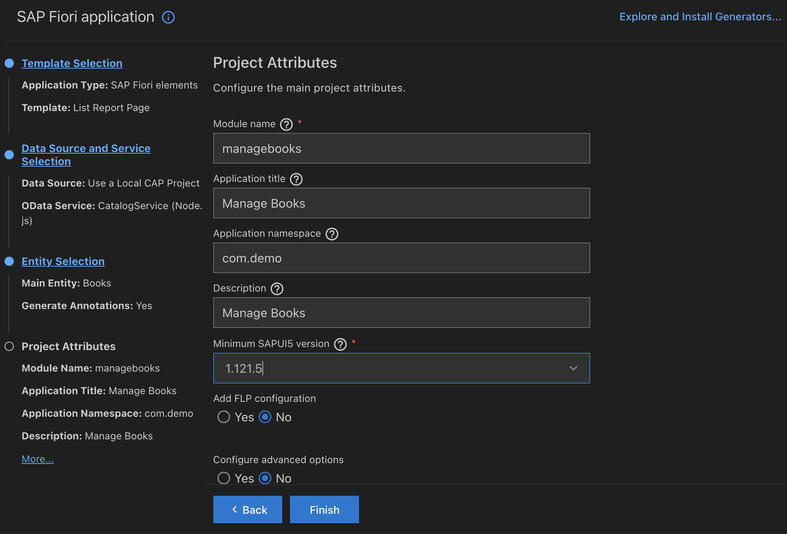

> In the generated project, update the path of the service in the manifest.json.
> 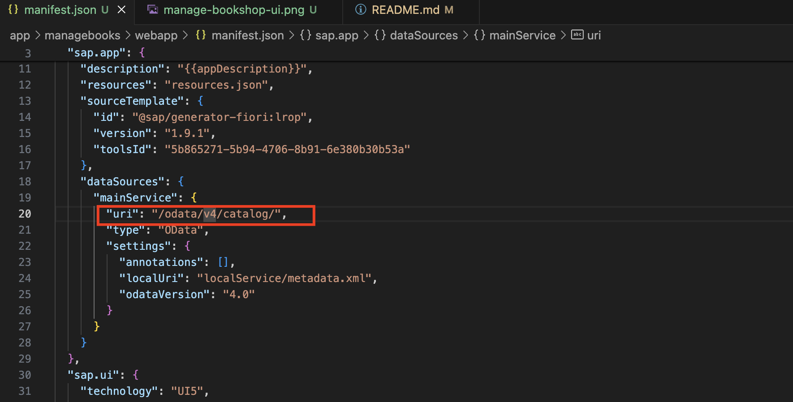

Execute the command `cds watch` to run the service. Now you should be able to see the ui5 application served. 

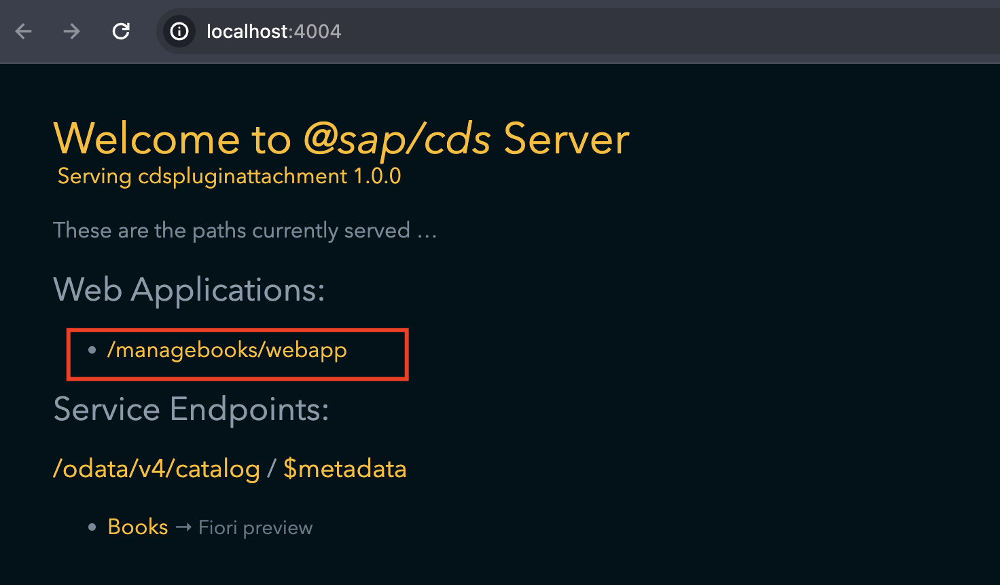

The list report page and object page of the application as of now should be as below. 

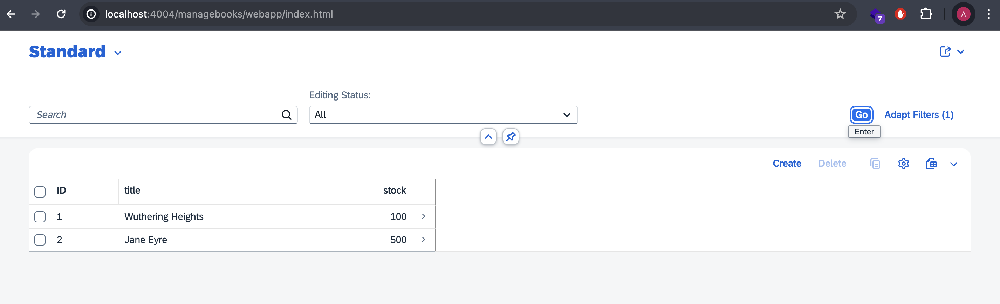

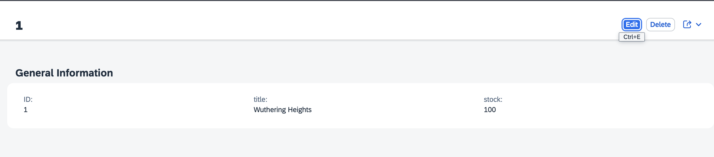

# Step 4: Add the attachment Plugin. 

To add the Attachment plugin, execute the following command from the terminal.

```sh
npm add @cap-js/attachments
```

In the `db` folder add a new schema file, let's name it `attachment.cds` and the following to extend the Book entity with the composition to attachment aspect from the attachment plugin. 

```
using {my.bookshop as my} from './data-model';
using {Attachments} from '@cap-js/attachments';

extend my.Books with {
    attachments : Composition of many Attachments;
}
```

And that's it!!. now run the `cds watch` and see the Magic. 

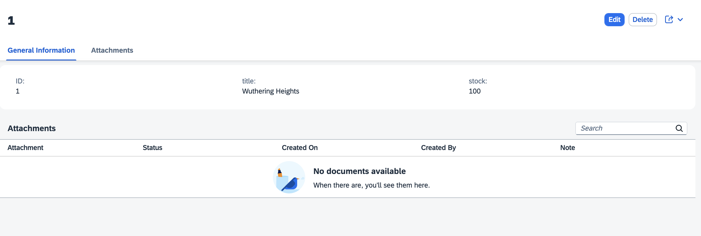

# How did it work?

The Plugin for Attachment, provides two aspects named `MediaData` and `Attachment`. 

```
using { managed, cuid } from '@sap/cds/common';

aspect MediaData @(_is_media_data) {
  url      : String;
  content  : LargeBinary @title: 'Attachment'; // only for db-based services
  mimeType : String @title: 'Media Type' default 'application/octet-stream';
  filename : String @title: 'Filename';
  status   :  String @title: 'Status' enum {
    Unscanned;
    Scanning;
    Infected;
    Clean;
  } default 'Unscanned';
}

aspect Attachments : managed, cuid, MediaData {
  note : String @title: 'Note';
}
```

The Media Data Aspect is annotated with `@UI.MediaResource` to specify which field represent `MediaType` and which field represents the `MimeType`. 

```
annotate MediaData with @UI.MediaResource: { Stream: content } {
  content  @Core.MediaType: mimeType @odata.draft.skip;
  mimeType @Core.IsMediaType;
  status @readonly;
}
```

The Attachment Aspect is annotated with the `LineItem`. 

```
annotate Attachments with @UI:{
  LineItem: [
    {Value: content},
    {Value: status},
    {Value: createdAt},
    {Value: createdBy},
    {Value: note}
  ]
} {
  content
    @Core.ContentDisposition: { Filename: filename, Type: 'inline' }
    @Core.Immutable
}
```

At runtime, when the plugin is called, the Line item annotation is added the UI facets by the plugin. 

Refer to file: node_modules>@cap-js>attachment>lib>plugin.js

```js
cds.on("loaded", function unfoldModel(csn) {
  if (!("Attachments" in csn.definitions)) return;
  cds.linked(csn).forall("Composition", (comp) => {
    if (comp._target["@_is_media_data"] && comp.parent && comp.is2many) {
      let facets = comp.parent["@UI.Facets"];
      if (!facets) return;
      DEBUG?.("Adding @UI.Facet to:", comp.parent.name);
      facets.push({
        $Type: "UI.ReferenceFacet",
        Target: `${comp.name}/@UI.LineItem`,
        Label: "{i18n>Attachments}",
      });
    }
  });
});
```

The example about different plugin can be found in the github repository Incidents. 
https://github.com/cap-js/incidents-app


The repository of this example is available in :
https://github.com/arunkrishnamoorthy/cds-plugin-attachment

Also if you want to try the same, with out the attachment plugin to see how it its working, checkout this below repository. 
